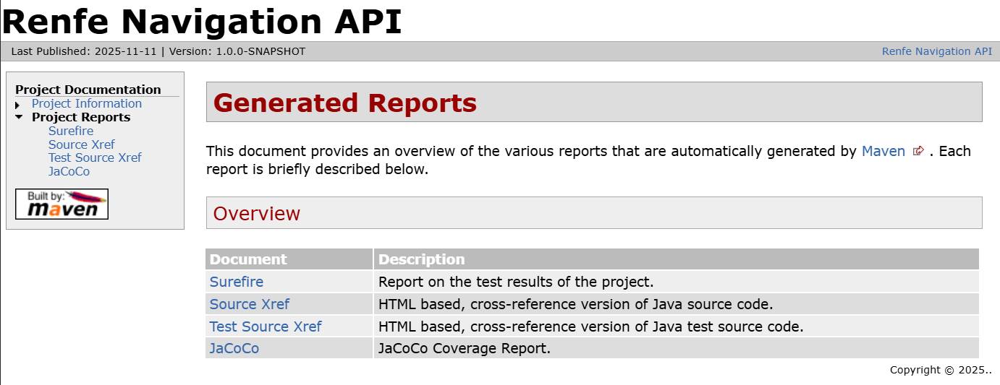

# Testing and Debugging

[← Back to README](../README.md)

This project separates fast unit tests, Quarkus integration tests, and end-to-end tests.

## Test Structure

The project organizes tests into three categories:

```
src/test/java/unit/         # Unit tests (*Test.java) - fast, isolated, use mocks
src/test/java/integration/  # Integration tests (*IT.java) - @QuarkusTest, debuggable
src/test/java/e2e/          # E2E tests (*E2E.java) - @QuarkusIntegrationTest, packaged app
```

### Test Types

- **Unit Tests** (`*Test.java`): Fast, isolated tests using JUnit 5 and Mockito. No Quarkus context required.
- **Integration Tests** (`*IT.java`): Tests with `@QuarkusTest` annotation. Run in Quarkus context, allow CDI injection, debuggable from IDE.
- **E2E Tests** (`*E2E.java` or `*ITCase.java`): Tests with `@QuarkusIntegrationTest` annotation. Run against packaged application.

## Running All Tests

### Run All Tests (Unit + Integration + E2E)

```bash
./mvnw clean verify
```

This command runs all test types and generates reports.

### Generate Site Report

The Maven site report provides a comprehensive view of test results, code coverage, and project documentation. Generate it with:

**For unit tests only** (recommended - avoids Quarkus server processes):

```bash
./mvnw clean test site jacoco:check
```

**Note**: Use `test` instead of `verify` when running only unit tests. The `verify` phase triggers Failsafe plugin which may start Quarkus server processes that need to be manually stopped.



Then open the site report:

**📊 [View Test Reports](../target/site/index.html)** - Complete test execution results and project information

#### Generated Reports

The site report includes the following generated reports:

1. **Surefire Report**
   - **Purpose**: Detailed test execution results for unit and integration tests
   - **Location**: `target/site/surefire-report.html`
   - **Content**: 
     - Summary of all tests (total, passed, failed, skipped)
     - Breakdown by package with success rates and execution times
     - Individual test case details with execution status
     - Full test output and stack traces for failures
   - **Generated by**: `maven-surefire-plugin` (executes `*Test.java` and `*IT.java` tests)

2. **Source Xref**
   - **Purpose**: HTML-based cross-reference of Java source code
   - **Location**: `target/site/xref/index.html`
   - **Content**:
     - Navigable source code with syntax highlighting
     - Cross-references between classes and methods
     - Line numbers for easy navigation
     - Links to related classes and dependencies
   - **Generated by**: `maven-jxr-plugin`

3. **Test Source Xref**
   - **Purpose**: HTML-based cross-reference of Java test source code
   - **Location**: `target/site/xref-test/index.html`
   - **Content**:
     - Navigable test source code with syntax highlighting
     - Cross-references between test classes and methods
     - Line numbers for easy navigation
     - Links to related test classes
   - **Generated by**: `maven-jxr-plugin`

4. **JaCoCo Coverage Report** (if configured)
   - **Purpose**: Code coverage metrics and detailed coverage analysis
   - **Location**: `target/site/jacoco/index.html`
   - **Content**:
     - Overall coverage statistics (lines, branches, methods, classes)
     - Package-level coverage breakdown
     - Class-level coverage with line-by-line details
     - Coverage thresholds and compliance status
     - Visual indicators (green/yellow/red) for coverage levels
   - **Generated by**: `jacoco-maven-plugin`
   - **Note**: Only measures coverage for unit and integration tests (excludes E2E tests)

All reports are accessible from the main site index page and provide comprehensive insights into test execution, code quality, and project structure.

## Running Tests by Type

### Unit Tests Only

Run all unit tests (fast, isolated tests):

```bash
./mvnw test -DskipITs=true -Dtest="**/*Test.java"
```

### Integration Tests Only (@QuarkusTest)

Run all integration tests that use `@QuarkusTest`:

```bash
./mvnw test -DskipITs=true -Dtest="**/*IT.java"
```

### E2E Tests Only (@QuarkusIntegrationTest)

Run all end-to-end tests:

```bash
./mvnw verify -DskipTests=true -DskipITs=false
```

**Important**: E2E tests require the application to be packaged first. If you get an error about missing artifact metadata, run `package` before the tests:

```bash
# Package the application first
./mvnw package -DskipTests

# Then run E2E tests
./mvnw verify -DskipTests=true -DskipITs=false
```

Or combine both in a single command:

```bash
./mvnw package -DskipTests -DskipITs=false verify
```

### Unit + Integration Tests (Skip E2E)

Run unit and integration tests together (skipping E2E):

```bash
./mvnw test -DskipITs=true
```

## Running Specific Tests

### Run a Specific Test Class

Run a single test class by name:

```bash
./mvnw test -Dtest=StationTest
```

Example with full class name:

```bash
./mvnw test -Dtest=com.delard.renfe.navigation.domain.model.StationTest
```

### Run a Specific Integration Test

Run a specific integration test class:

```bash
./mvnw test -Dtest=PlaywrightSearchTrainsServiceIT
```

### Run a Specific E2E Test (Packaged App)

When you only want to execute a single `@QuarkusIntegrationTest` class and skip the rest of the lifecycle, call Failsafe directly. This prevents Surefire from launching unit and integration suites while still running the targeted E2E test:

**Important**: E2E tests require the application to be packaged first. Make sure to run `package` before executing the test:

```bash
# Package the application first
./mvnw package -DskipTests

# Then run the specific E2E test
./mvnw -DskipTests -DskipITs=false failsafe:integration-test failsafe:verify -Dit.test=StationsEndpointE2E
```

Or combine both in a single command:

```bash
./mvnw package -DskipTests -DskipITs=false failsafe:integration-test failsafe:verify -Dit.test=StationsEndpointE2E
```

**Examples:**
- Run only `StationsEndpointE2E`:
  ```bash
  ./mvnw package -DskipTests -DskipITs=false failsafe:integration-test failsafe:verify -Dit.test=StationsEndpointE2E
  ```

- Run only `TrainsEndpointE2E`:
  ```bash
  ./mvnw package -DskipTests -DskipITs=false failsafe:integration-test failsafe:verify -Dit.test=TrainsEndpointE2E
  ```

- Run only `TicketsEndpointE2E`:
  ```bash
  ./mvnw package -DskipTests -DskipITs=false failsafe:integration-test failsafe:verify -Dit.test=TicketsEndpointE2E
  ```

- `-DskipTests` stops Surefire (`*Test.java` + `*IT.java`) from executing.
- `-DskipITs=false` enables Failsafe so `*E2E.java` tests run.
- `-Dit.test=StationsEndpointE2E` can be replaced with any class or pattern (e.g., `*Stations*E2E` or `StationsEndpointE2E,TicketsEndpointE2E`).

Use this command whenever you need to focus on a single endpoint’s E2E coverage without paying the cost of every other suite.

### Run a Specific Test Method

Run a single test method within a class:

```bash
./mvnw test -Dtest=StationTest#testStationEquals
```

### Run Multiple Specific Tests

Run multiple test classes:

```bash
./mvnw test -Dtest=StationTest,GetStationsServiceTest
```

### Run Tests Matching a Pattern

Run all tests matching a pattern:

```bash
./mvnw test -Dtest="*Station*"
```

## Code Coverage

### Generate Coverage Report

Run unit tests and generate JaCoCo coverage report:

```bash
./mvnw clean test site jacoco:check
```

**Note**: Use `test` instead of `verify` when running only unit tests. The `verify` phase triggers Failsafe plugin which may start Quarkus server processes.

Then open the coverage report:
- **Direct link**: [View Coverage Report](../target/site/jacoco/index.html)

### Check Coverage Thresholds

Run tests and verify coverage meets minimum thresholds:

```bash
./mvnw clean test jacoco:check
```

**Note**: Use `test` instead of `verify` to avoid Failsafe plugin processes.

## Debugging

### Debugging the Server (Development Mode)

When running the server in development mode (`quarkus:dev`), you can enable debugging and configure Playwright for visual debugging.

#### Enable Debug Mode

To enable debugging, add the `-Ddebug` flag when starting the server:

```bash
./mvnw quarkus:dev -Ddebug
```

Maven will print:
```
Listening for transport dt_socket at address: 5005
```

Then attach your IDE debugger to port 5005:
- **VS Code**: Use the "Debug Quarkus application" launch configuration
- **IntelliJ IDEA**: Create a Remote JVM Debug configuration for port 5005

#### Visual Debugging with Playwright

To see the browser executing actions (useful for debugging Playwright interactions), you can override Playwright configuration at runtime:

**Slow execution with visible browser (recommended for debugging):**
```bash
./mvnw quarkus:dev -Ddebug \
  -Dplaywright.headless=false \
  -Dplaywright.slow-mo=5000 \
  -Dplaywright.timeout-navigation-ms=60000 \
  -Dplaywright.timeout-networkidle-ms=60000
```

**Parameters explained:**
- `-Dplaywright.headless=false`: Shows the browser window (not headless)
- `-Dplaywright.slow-mo=5000`: Adds 5 second delay between actions (adjust as needed)
- `-Dplaywright.timeout-navigation-ms=60000`: Increases navigation timeout to 60 seconds
- `-Dplaywright.timeout-networkidle-ms=60000`: Increases network idle timeout to 60 seconds

**Alternative: Using environment variables:**
```bash
export PLAYWRIGHT_HEADLESS=false
export PLAYWRIGHT_SLOW_MO=5000
export PLAYWRIGHT_TIMEOUT_NAVIGATION_MS=60000
./mvnw quarkus:dev -Ddebug
```

**Alternative: Using .env file:**
Add to your `.env` file:
```bash
PLAYWRIGHT_HEADLESS=false
PLAYWRIGHT_SLOW_MO=5000
PLAYWRIGHT_TIMEOUT_NAVIGATION_MS=60000
```

Then run:
```bash
./mvnw quarkus:dev -Ddebug
```

#### Override Playwright Properties

You can override any Playwright property at runtime using one of these methods:

1. **Command line arguments** (highest priority):
   ```bash
   ./mvnw quarkus:dev -Dplaywright.headless=false -Dplaywright.slow-mo=5000
   ```

2. **Environment variables**:
   ```bash
   export PLAYWRIGHT_HEADLESS=false
   export PLAYWRIGHT_SLOW_MO=5000
   ./mvnw quarkus:dev
   ```

3. **.env file** (in project root):
   ```bash
   PLAYWRIGHT_HEADLESS=false
   PLAYWRIGHT_SLOW_MO=5000
   ```

See `src/main/resources/application.properties` for all available Playwright configuration properties.

### Debugging Tests

#### Method 1: Debug with Quarkus Test Mode (Recommended)

Quarkus provides a continuous testing mode that allows you to debug tests with the Quarkus context running. This is the most convenient method for debugging integration tests.

#### Debug a Specific Integration Test

Run a specific integration test in debug mode:

```bash
./mvnw quarkus:test -Dit.test=PlaywrightSearchTrainsServiceIT -Ddebug
```

Maven will print:
```
Listening for transport dt_socket at address: 5005
```

Then attach your IDE debugger to port 5005.

#### Debug from IDE after Starting Server

You can also start the Quarkus test server in debug mode and then run tests from your IDE:

1. **Start Quarkus test server in debug mode**:

```bash
./mvnw quarkus:test
```

Maven will print:
```
Listening for transport dt_socket at address: 5005
```

2. **Attach debugger to port 5005** (using your IDE's attach configuration)

3. **Run the test from your IDE** (right-click on test class/method and select "Run" or "Debug")

This approach allows you to:
- Keep the Quarkus context running between test executions
- Run tests directly from your IDE while debugging
- Avoid restarting the Quarkus context for each test run

#### Method 2: Debug Integration Tests from VS Code

1. **Using VS Code Task**:
   - Run task: `maven: debug QuarkusTest (Surefire)`
   - Enter test class name (e.g., `PlaywrightSearchTrainsServiceIT`)

2. **Attach Debugger**:
   - Use launch config: `Attach to Quarkus Test Debugger` (port 5005)

#### Method 3: Debug from Terminal with Surefire

Run a specific test in debug mode using Surefire:

```bash
./mvnw surefire:test -Dtest=PlaywrightSearchTrainsServiceIT -Dmaven.surefire.debug
```

Maven will print:
```
Listening for transport dt_socket at address: 5005
```

Then attach your IDE debugger using the launch config "Attach to Quarkus Test Debugger" (port 5005).

#### Debug a Specific Test Method

Debug a single test method:

```bash
# Using Quarkus test mode
./mvnw quarkus:test -Dit.test=StationTest#testStationEquals -Ddebug

# Or using Surefire
./mvnw surefire:test -Dtest=StationTest#testStationEquals -Dmaven.surefire.debug
```

## Test Configuration

### Unit Tests

- Run without Quarkus context
- Use mocks/stubs for isolation
- No test profile required
- Fast execution

### Integration Tests

Integration tests use a dedicated test profile:

- **Profile**: `@TestProfile(PlaywrightIntegrationTestProfile.class)`
- **Configuration**: `src/test/resources/application-integration.properties`
- **Purpose**: Configure Playwright settings for debugging

Key Playwright options in `application-integration.properties`:

```properties
# Enable visible browser for debugging
playwright.headless=false

# Slow down execution to observe test steps
playwright.slow-mo=4000

# Increase timeouts for debugging
playwright.timeout-navigation-ms=60000
playwright.timeout-networkidle-ms=60000
```

#### Override Playwright Configuration via Maven System Properties

You can override `playwright.headless` and `playwright.slow-mo` via Maven system properties (`-D`) without modifying the properties file. This is useful for local debugging without affecting CI/CD pipeline execution.

**System properties have higher priority than the properties file**, so they will override the default values.

##### Examples

**Run with visible browser and slow motion (for debugging):**
```bash
./mvnw test -Dtest=PlaywrightSearchTrainsServiceIT \
  -Dplaywright.headless=false -Dplaywright.slow-mo=4000
```

**Run with headless mode and no delay (for fast execution):**
```bash
./mvnw test -Dtest=PlaywrightSearchTrainsServiceIT \
  -Dplaywright.headless=true -Dplaywright.slow-mo=0
```

**Run with visible browser but fast execution:**
```bash
./mvnw test -Dtest=PlaywrightSearchTrainsServiceIT \
  -Dplaywright.headless=false -Dplaywright.slow-mo=0
```

**Run without overrides (uses values from application-integration.properties):**
```bash
./mvnw test -Dtest=PlaywrightSearchTrainsServiceIT
```

**Note**: The values in `application-integration.properties` are used as defaults when system properties are not provided. This allows you to:
- Keep default values optimized for CI/CD in the properties file
- Override them locally for debugging without committing changes
- Share the same test configuration across the team

### E2E Tests

- Run against packaged application
- Cannot inject beans directly
- Communicate via HTTP/network
- Test complete application flow

## Advanced Examples

### Run Tests and Generate Site (Ignore Failures)

Run all tests, generate site report, and continue even if tests fail:

```bash
./mvnw clean test site -DskipITs=true -Dtest="**/*Test.java" -Dmaven.test.failure.ignore=true
```

### Run Specific Integration Test with Site Report

Run a specific integration test (`@QuarkusTest`) and generate site report:

```bash
./mvnw clean test site -Dtest=PlaywrightSearchTrainsServiceIT
```

**Note**: Integration tests with `@QuarkusTest` are executed by Surefire (not Failsafe), so use `test` instead of `verify`.

### Run Only Unit Tests (Exclude Integration)

Run only unit tests, explicitly excluding integration tests:

```bash
./mvnw test -DskipITs=true -Dtest="**/*Test.java" -Dexcludes="**/*IT.java"
```

## Test Reports and Documentation

### Maven Site Report

The Maven site report contains comprehensive information about:
- Test execution results
- Code coverage
- Project documentation
- Dependencies

**📊 [View Maven Site Report](../target/site/index.html)**

Generate the site report (without E2E tests):

```bash
./mvnw clean test site jacoco:check
```

**Note**: This command uses `test` instead of `verify` to avoid triggering Failsafe plugin which may start Quarkus server processes. Use this for generating site reports with unit and integration tests only.

### JaCoCo Coverage Report

View code coverage metrics:

**📊 [View Coverage Report](../target/site/jacoco/index.html)**

Generate coverage report:

```bash
./mvnw clean test
```

## Tips and Best Practices

1. **Run unit tests frequently** - They're fast and provide quick feedback
2. **Use `quarkus:test` mode for debugging** - Start with `./mvnw quarkus:test` and run tests from your IDE while attached to the debugger (port 5005)
3. **Use integration tests for debugging** - They allow IDE debugging with `@QuarkusTest`
4. **Override Playwright config via `-D` flags** - Use `-Dplaywright.headless=false -Dplaywright.slow-mo=4000` for local debugging without modifying properties files
5. **Configure Playwright in properties** - Set default values in `application-integration.properties` for CI/CD
6. **Check coverage regularly** - Ensure tests cover critical code paths
7. **Use specific test runs** - Run only what you need during development

## Troubleshooting

### Tests Not Found

If tests are not found, ensure:
- Test files follow naming conventions (`*Test.java`, `*IT.java`, `*E2E.java`)
- Tests are in correct directories (`src/test/java/unit/`, `src/test/java/integration/`, `src/test/java/e2e/`)

### Debugger Not Attaching

If debugger doesn't attach:
- Check that Maven printed the debug port (usually 5005)
- Verify VS Code launch config port matches
- Ensure no firewall is blocking the connection

### Coverage Report Not Generated

If coverage report is missing:
- Run `./mvnw clean test` to ensure JaCoCo agent is active
- Check that unit tests were executed
- Verify `target/site/jacoco/index.html` exists
